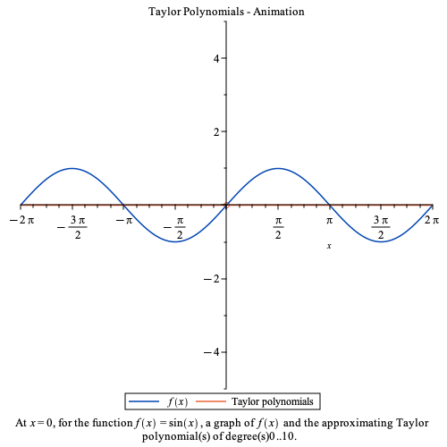

# Uendelige rækker

I dette kapitel vil vi se på summer er der er uendelige. Formålet med denne type summer er, at de kan anvendes til at tilnærme funktioner fx \\(e^x,\ \sin(x), \cos(x)\\) og værdier fx \\(e,\ \pi\\). Den primære teknik til at beregne disse ting er det, der kaldes taylorpolynomier.

Vi begynder dog et andet sted nemlig med den geometriske række, vi også mødte i sidste kapitel.

## Den uendelige geometriske række

I det sidste kapitel så vi på den geometriske række \\[1+x+x^2+x^3+\ldots+x^n\\] Vi begynde med, at skrive denne række med *sumtegnsnotation*. Vi bemærker, at \\(x^0=1\\), så rækken kan også skrives \\(x^0+x^1+x^2+\ldots+x^n\\). Dermed er "tæller" eksponenten, hvilket led vi er ved. Dette kan bruges til at skrive den geometriske række på denne måde\\[\sum_{k=0}^{n} x^k\\]
Symbolet \\(\sum\\) er det store græske bogstav sigma, og det betyder sum. Udtrykket skal læses sådan, at vi begynder ved \\(k=0\\). Det sætter vi ind i udtrykket efter \\(\sum\\), hvorefter vi sætter et +. Nu lader vi \\(k\\) vokse med 1, så \\(k=1\\), det indsætter vi og så videre indtil \\(k=n\\).

Hvis vi fx vil skrive følgende ud \\[\sum_{k=0}^{4} x^k\\]
så vil vi få følgende

|\\(k\\) | \\(x^k\\) |
|:--:|:--:|
| 0 | \\(x^0=1\\) |
| 1 | \\(x^1=x\\) |
| 2 | \\(x^2\\) |
| 3 | \\(x^3\\) |
| 4 | \\(x^4\\) |
| i alt| \\(1+x+x^2+x^3+x^4\\) |

Det vil sige, \\[\sum_{k=0}^{4}x^k=x+x+x^2+x^3+x^4\\]

> [!NOTE]
> Bemærk, at det ikke altid er sådan, at \\(k=0\\), ofte giver det mening, at begynde med en anden værdi. I denne tekst vil vi dog altid begynde ved \\(k=0\\).

Vi vil nu skifte \\(n\\) ud med \\(\infty\\), det vil sige, at vi ønsker at lægge uendelig mange tal sammen. Hvordan får vi det til at give mening? Svaret er, at hvis vi stopper vores sum ved et \\(n\\), så vil det altid give et tal (vi lægger endelig mange tal sammen). Det kaldes *delsummen* og betegnes \\(S_n\\). Dermed har vi oven for lavet \\(S_4=1+x+x^2+x^3+x^4\\). Med symboler, hvor \\(f(k)\\) er et udtryk, der står efter sumtegnet. \\[S_n=\sum_{k=0}^{n} f(k)\\]

Så hvis en uendelig sum skal give mening, må følgen af delsummer \\(\\{S_n\\}\\) være konvergent. Vi vil nu se på den uendelige geometriske række: 
\\[\sum_{k=0}^{\infty} x^k\\]

Vi vil vise, at rækken er konvergent, når \\(-1 < x < 1\\), og at \\[ \sum_{k=0}^{\infty} x^k=\frac{1}{1-x}\\]

Det første, vi bemærker, er, at når \\(x=1\\), så må \\[\sum_{k=0}^{\infty} 1^k=\infty\\]

Det andet, vi bemærker, er, at vi har et udtryk for delsummen. I sidste kapitel viste vi, at \\[S_n=\sum_{k=0}^{n}x^k=\frac{x^{n+1}-1}{x-1}\\] 

Så vi skal undersøge konvergens for \\(\\{S_n\\}=\left\\{\frac{x^{n+1}-1}{x-1}\right\\}\\). Vi tager grænsen på begge sider af lighedstegnet:
\\[\lim_{n\to \infty} S_n =\lim_{n\to\infty} \frac{x^{n+1}-1}{x-1}\\]
\\[\lim_{n\to \infty} S_n = \frac{\lim_{n\to\infty}(x^{n+1}-1)}{\lim_{n\to\infty}(x-1)}\\]
Da \\(n\\) ikke optræder i nævneren af brøken, får vi:
\\[\lim_{n\to\infty} S_n= \frac{\lim_{n\to\infty} (x^{n+1})-1}{x-1}\\]
Så vi ender med at skulle se på grænsen: \\[\lim_{n\to\infty} x^{n+1}\\]
Men den behandlede vi i første kapitel, hvor vi så, at den var konvergent, når \\(-1 < x \leq 1\\). Vi har dog oven for udelukket \\(x=1\\). Det vil sige, når \\(-1 < x < 1\\) \\[\lim_{n\to\infty} x^{n+1}=0\\] 
Og dermed er:
\\[\lim_{n\to \infty} S_n =\frac{-1}{x-1}\\]
Da \\(x-1=-(1-x)\\), får vi:
\\[\lim_{n\to \infty} S_n =\frac{-1}{-(1-x)}=\frac{1}{1-x}\\]
Dermed har vi vist, at
\\[ \sum_{k=0}^{\infty} x^k=\frac{1}{1-x}\\]
når \\(-1 < x < 1\\).

> [!NOTE]
> Kravet om, at \\(-1 < x < 1\\) er et eksempel på det, der hedder *konvergensradius*. Hvilket betyder, at der et interval, hvor den uendelige række konvergere og et område, hvor den divergerer. Disse områder kan være vanskelige at beregne, så vi vil ikke gøre mere ud af dem i disse noter.

## Taylorpolynomiet

I dette afsnit vil vi behandle tilnærmninger til funktioner med taylorpolynomier. Fordi vi anvender uendelige rækker, er der nogle tekniske overvejelser omkring konvergens, som vi vil springe over. 

Vi kommer til at skulle differentiere funktioner rigtig mange gange, så vi får brug for noget notation, hvis vi ikke ønsker udtryk som \\(f^{\prime\prime\prime\prime\prime}(x)\\).

|Notation|
|--|
| Hvis \\(f\\) er en funktion, der kan differentieres uendelig mange gange, så skriver vi \\(f^{(k)}(x)\\) for den \\(k\\)'te afledte. Særligt gælder: \\[f^{(0)}(x)=f(x),\quad f^{(1)}(x)=f'(x),\quad f^{(2)}(x)=f''(x)\\] |

Vi kan nu definere, hvad vi mener med taylorpolynomiet for en funktion.

| Definition |
|--|
| Hvis funktionen \\(f\\) kan differentieres uendelig mange gange i \\(x=c\\), så kaldes rækken: \\[\sum_{k=0}^{\infty} \frac{f^{(k)}(c)}{k!}\cdot (x-c)^k\\] for *taylorpolynomiet* for \\(f\\) omkring \\(c\\). Bemærk at \\(0!=1\\) pr. definition.|

Da vi aldrig kan lægge uendelig mange tal sammen, så anvendes taylorpolynomiet til at tilnærme en funktion. Hvis vi regner tilstrækkelig mange led ud kan vi give et bud på en funktionsværdi. Følgende figur viser grafen for sinus og forskellige taylorpolynomier, hvor man kun har taget nogle led med. Jo flere led, jo tættere kommer taylorpolynomiet på sinus.

Vi vil vise, hvordan et taylorpolynomium kan beregnes for to funktioner, nemlig den naturlige eksponentialfunktion og sinus.

### Den naturlige eksponentialfunktion

Den naturlige eksponentialfunktion \\(e^x\\) er defineret ved, at den giver sig selv differentieret \\(f'(x)=f(x)\\), og at \\(f(0)=1\\). Dermed er \\(f^{\prime\prime}(x)=(f'(x))'=(f(x))'=f(x)\\) og så fremdeles. Yderligere gælder det, at \\[1=f(0)=f'(0)=f''(0)=f^{3}(0)=\ldots=f^{(k)}(0)\\]
så hvis vi sætter \\(c=0\\), får vi:
\\[\sum_{k=0}^{\infty} \frac{f^{(k)}(c)}{k!}\cdot (x-c)^k=\sum_{k=0}^{\infty} \frac{f^{(k)}(0)}{k!}\cdot (x-0)^k\\]
Eller:
\\[e^x=\sum_{k=0}^{\infty} \frac{1}{k!}\cdot x^k=\sum_{k=0}^{\infty} \frac{x^k}{k!}\\]

Dette tages ofte til at være definitionen for \\(e^x\\).

Vi kan nu beregne \\(e\\), idet \\(e^1=e\\):
\\[e=e^1=\sum_{k=0}^{\infty} \frac{1^k}{k!}=1+1+\frac{1^2}{2!}+\frac{1^3}{3!}+\frac{1^4}{4!}+\ldots\\]
\\[e=2+\frac{1}{2}+\frac{1}{6}+\frac{1}{24}+\ldots\\]

### Sinus og cosinus

For sinus gælder at \\(\sin(0)=0\\) og for cosinus gælder at \\(\cos(0)=1\\). Derudover gælder for \\(f(x)=\sin(x)\\)
| Funktion | Værdi |
|--|--|
| \\(f(x)=\sin(x)\\) | \\(f(0)=\sin(0)=0\\) |
| \\(f'(x)=\cos(x)\\) | \\(f'(0)=\cos(0)=1\\) |
| \\(f^{(2)}(x)=-\sin(x)\\) | \\(f^{(2)}(0)=-\sin(0)=0\\) |
| \\(f^{(3)}(x)=-\cos(x)\\) | \\(f^{(3)}(0)=-\cos(0)=-1\\) |
| \\(f^{(4)}(x)=\sin(x)\\) | \\(f^{(4)}(0)=\sin(0)=0\\) |

Vi bemærker, at det kun er de ulige tal, der giver noget til summen idet fx \\(\frac{f^{(2)}(0)}{2!}=\frac{0}{2!}=0\\). Derudover skifter fortegene. Så taylorpolynomiet for sinus, når \\(c=0\\), bliver:
\\[0+x+0-\frac{x^3}{3!}+0+\frac{x^5}{5!}+\ldots =x-\frac{x^3}{3!}+\frac{x^5}{5!}-\frac{x^7}{7!}+\ldots\\]
Da ulige tal kan skrives \\(2k+1\\), får vi:
\\[\sin(x)=\sum_{k=0}^{\infty} \frac{(-1)^k}{(2k+1)!}\cdot x^{2k+1}\\]
Man kan på samme måde vise at:
\\[\cos(x)=\sum_{k=0}^{\infty}\frac{(-1)^k}{(2k)!}\cdot x^{2k}\\]

## Vurdering af fejl
Vi kan aldrig beregne alle led i et taylorpolynomium. Hvor vi er nødt til at stoppe på et tidspunkt. Vi indfører det begrænsede taylorpolynomium \\(T_n(x)\\), som er givet ved:

\\[T_n(x)=\sum_{k=0}^n \frac{f^{(k)}(c)}{k!}\cdot (x-c)^k\\]

Med andre ord stopper vi summen ved \\(n\\). Vores begrænsede taylorpolynomium vil ikke være præcist, da vi ikke har alle led med. Hvis polynomiet er en tilnærmning til \\(f(x)\\), så er forskellen mellem polynomium og funktion et mål for fejlen. Det vil vi betegne \\(R_n(x)\\) og kalde *residualet*. Det gælder dermed:
\\[R_n(x)=f(x)-T_n(x)\\]
Eller:
\\[f(x)=T_n(x)+R_n(x)\\]
Men hvordan beregner vi \\(R_n(x)\\)? En måde er ved følgende integral:
\\[R_n(x)=\int_{c}^{x}\frac{f^{(n+1)}(t)}{n!}\cdot(x-t)^n\ dt\\]

Vi giver et eksempel med \\(f(x)=e^x\\). Vi har fundet taylorpolynomiet for \\(f\\) omkring \\(c=0\\) oven for. Så vi kan undersøge residualet for \\(T_4(x)=\sum_{k=0}^4 \frac{x^k}{k!}\\), når \\(x=1\\). Med andre ord, så ser vi på, hvor stor fejl der på \\(T_4(1)\\) i forholde til \\(f(1)=e^1=e\\). Vi skal bruge formlen for residualet:
\\[R_n(x)=\int_{c}^{x}\frac{f^{(n+1)}(t)}{n!}\cdot(x-t)^n\ dt\\]
Her kender vi en del af bogstaverne i forvejen: \\(c=0\\), \\(x=1\\) og \\(n=4\\). Vi mangler dog at beregne \\(f^{(n+1)}(t)\\). Da vores funktion er \\(f(x)=e^x\\), ved vi, at \\(f^{5}(t)=e^t\\), så vores integral bliver:
\\[R_4(1)=\int_{0}^{1}\frac{e^t}{4!}\cdot(1-t)^4\ dt\\]
En computer fortæller os, at det giver \\(\approx 0{,}01\\). Så udregningen er kun korrekt inden for en decimal. Generelt vil det være således, at jo længere \\(x\\) er fra \\(c\\), jo flere led skal der anvendes.

> [!Note]
> Bemærk to ting. For det første, behøver vi ikke kende \\(T_n(x)\\) for at kunne beregne residualet. For det andet, findes der andre og mere effektive metoder til at bestemme residualet, men de er mere komplicerede at forklare. Et bevis for residualet ligger uden for disse noter.

