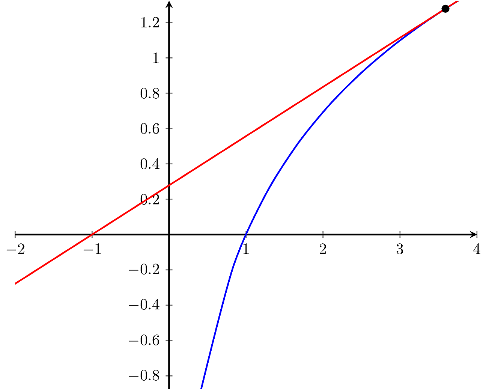

# Newtons metode

Dette kapitel handler om Newtons metode. Metoden anvendes til at løse ligninger, som vi generelt vil have svært ved. Metoden kan også anvendes til at bestemme kvadratrødder eller lignende. 

Newtons metode anvendes til at løse ligninger på formen: \\[f(x)=0\\] hvilket vi normalt kalder nulpunkter. Men hvad med fx ligningen: \\[e^x=x+1\\] Den kan vi lave om, så den bliver til \\[x^x-x-1=0\\] Helt generelt kan alle ligninger på formen \\(f(x)=g(x)\\) laves om til \\(f(x)-g(x)=0\\), hvorfor det er nok at lede efter nulpunkter. 

Udgangspunktet for metoden er, at vores \\(f\\) er en differentiabel funktion (og dermed også kontinuert). Vi ved, at \\(f\\) kan tilnærmes med en tangent \\(y=f'(x_0)\cdot (x-x_0)+f(x_0)\\) i alle punkter. Så vi laver et gæt, på det vi tror er nulpunktet, og sætter vi tangenten til 0, og løser ligningen:

\\[0=f'(x_0)\cdot(x-x_0)+f(x_0)\\]
\\[-f(x_0)=f'(x_0)\cdot(x-x_0)\\]
\\[-\frac{f(x_0)}{f'(x_0)}=x-x_0\\]
\\[x_0-\frac{f(x_0)}{f'(x_0)}=x\\]

Så vores nye bud på en løsning til ligningen er vores \\(x\\) oven for. Hvis det ikke viser sig at være løsningen, kan vi prøve igen med \\(x\\) som et nyt gæt. Figur 1 viser, hvordan processen fungerer.

|Figur 1|
|:--:|
||
|Newtons metode anvendt på \\(f(x)=e^x-1\\) med begyndelsesværdi \\(x_1=3\\). Der kan ses de første fire iterationer. |

Newtons metode er altså en følge, der er givet ved formlen:
\\[x_{n+1}=x_n-\frac{f(x_n)}{f'(x_n)}\\]
Vi skal dog gætte på en begyndelsesværdi \\(x_1\\) for at komme i gang. 

Vi giver to eksempler:

## Eksempel 1 (kvadratrødder)
Alle kvadratrødder \\(\sqrt{a}\\) er løsninger til ligningen \\[x^2-a=0\\]

Vi vælger \\(x_1=1\\), fordi det gør udregningerne lettere. Vi har \\[f(x)=x^2-a\\] og \\[f'(x)=2x\\]
Dermed bliver følgen, der bestemmer Newtons metode til: \\[x_{n+1}=x_n-\frac{x_n^2-a}{2x_n}\\]

Vi gør formlen simplere: \\[x_{n+1}=x_n-\left(\frac{x_n^2}{2x_n}-\frac{a}{2x_n}\right)\\]
\\[x_{n+1}=x_n-\left(\frac{x_n}{2}-\frac{a}{2x_n}\right)\\]
\\[x_{n+1}=x_n-\frac{x_n}{2}+\frac{a}{2x_n}\\]
\\[x_{n+1}=\frac{x_n}{2}+\frac{a}{2x_n}\\]
\\[x_{n+1}=\frac{1}{2}\cdot\left(x_n+\frac{a}{x_n}\right)\\]

Lad os prøve at beregne \\(\sqrt{3}\\). Vi vælger \\(x_1=1\\). Så \\(x_2=\frac{1}{2}\cdot\left(1+\frac{3}{1}\right)=2\\)
Dermed er \\(x_3=\frac{1}{2}\cdot\left(2+\frac{3}{2}\right)=\frac{7}{4}\\). I en tabel ser det sådan ud, hvor vi har understreget den del af decimaltallene, der stemmer overens med kvadratroden af 3.:

| \\(n\\) | \\(x_n\\) | \\(x_{n+1}\\) |
|--|--|--|
| 1 | 1 | 2|
| 2 | 2 | \\(\\frac{7}{4}= \underline{1{,}7}5\\) |
| 3 | \\(\frac{7}{4}\\) | \\(\frac{97}{56}\approx \underline{1{,}732}1428571428571429\\)|
| 4 | \\(\frac{97}{56}\\) | \\(\frac{18817}{10864}\approx \underline{1{,}7320508}100147275405\\)|
| 5 | \\(\frac{18817}{10864}\\) | \\(\frac{708158977}{408855776}\approx \underline{1{,}73205080756887729}53\\)|

Vi bemærker, at antallet af korrekte cifre ca. fordobles mellem hver udregning. Ofte vil 6 udregninger være nok på en computer, da der ikke kan regnes med flere decimaler internt i processoren.

## Eksempel 2

Vi vil se på funktionen \\[f(x)=e^x-x-1\\] Det er let at indse, at \\(x=0\\) er en løsning, idet \\(f(0)=e^0-0-1=1-1=0\\).
Men vi vil alligevel afprøve newtons metode på denne ligning. Vi vælger \\(x_1=1\\), hvilket giver følgende tabel:

|\\(n\\)| \\(x_n\\) |
|--|--|
| 1 | 1 |
| 2 | \\(0{,}5819767070\\) |
| 3 | \\(0{,}3190550411\\) |
| 4 | \\(0{,}1679961727\\) |
| 5 | \\(0{,}08634887467\\) |
| 6 | \\(0{,}04379570901\\) |
| 7 | \\(0{,}02205769273\\) |
| 8 | \\(0{,}01106940034\\) |
| 9 | Her gik maple kold |

I modsætning til det første eksempel, så går det meget langsomt med at komme i nærheden af 0. Og ved \\(x_9\\) gik computeren (maple) død og kunne ikke regne videre. Så hvad er problemet? Hvis vi ser på formlen for Newtons metode: \\[x_{n+1}=x_n-\frac{f(x_n)}{f'(x_n)}\\]
Så kan vi se, at der divideres med \\(f'(x_n)\\). Vi må ikke dividere med 0, så lad os se om \\(f'(x)=0\\)?
Vi har: \\(f'(x)=e^x-1=0\\). Dermed skal \\(e^x=1\\), hvilket vil sige, at \\(x=0\\). Det vil sige, at jo tættere Newtons metode kommer på \\(x=0\\), jo tættere er vi på at dividere med 0. Med andre ord kan vi ikke være sikker på at metoden konvergerer.

## Konvergens af Newtons metode

Det er faktisk bøvlet at sige noget om konvergens af Newtons metode. Dels kan det være, at den ikke konvergerer. Det vil være tilfældet, hvis vi rammer \\(f'(x_n)=0\\) for et eller andet \\(n\\), for vi må ikke dividere med 0. Et andet problem kan være at \\(x_n\\) ender uden for vores funktions definitionsmængde.

Det kan fx ske, hvis funktionen er \\(\ln(x)\\), og vi vælger \\(x_1=3{,}5911\\). Se figur 2.

| Figur 2 |
|--|
||
| Figuren viser \\(\ln(x)\\) og dens tangent i \\((3.5911,1.278)\\). Tangenten skærer i \\(x=-1\\), hvilket ikke kan anvendes til næste udregning af følgen, da \\(\ln\\) ikke er defineret for negative tal.|

Dog hvis Newtons metode konvergerer, så er den hurtig (hvilket vi ikke vil bevise). Vi vil bevise, at metoden faktisk konvergerer til en løsning til \\(f(x)=0\\), når følgen konvergerer. Vi kommer til at skulle anvende en egenskab ved kontinuerte funktioner. Nemlig at det gælder at:

\\[\lim_{n\to\infty} f(x_n) = f\left(\lim_{n\to\infty}(x_n)\right)\\]

| Sætning |
|--|
| Hvis \\(x_{n+1}=x_n-\frac{f(x_n)}{f'(x_n)}\\) konvergerer til \\(r\\) for en passende begyndelsesværdi, så er \\(f(r)=0\\) |

**Bevis:** Vi har, at \\(\lim_{n\to\infty}(x_n)=r\\). Dermed har vi:
\\[x_{n+1}=x_n-\frac{f(x_n)}{f'(x_n)}\\]
\\[\lim_{n\to\infty} (x_{n+1})=\lim_{n\to\infty}\left(x_n-\frac{f(x_n)}{f'(x_n)}\right)\\]
\\[r=\lim_{n\to\infty}(x_n)-\lim_{n\to\infty}\left(\frac{f(x_n)}{f'(x_n)}\right)\\]
\\[r=r-\left(\frac{\lim_{n\to\infty}(f(x_n))}{\lim_{n\to\infty}(f'(x_n))}\right)\\]
\\[0=-\left(\frac{\lim_{n\to\infty}(f(x_n))}{\lim_{n\to\infty}(f'(x_n))}\right)\\]
Da nævneren ikke kan være negativ, må vi have at:
\\[0=\lim_{n\to\infty}(f(x_n))\\]
\\[0=f(\lim_{n\to\infty}(x_n))\\]
\\[0=f(r)\\]
Det vil sige, hvis Newtons metode konvergerer, så konvergerer den imod en løsning til \\(f(x)=0\\). \\(\square\\)

<!-- magick -density 300 newton.pdf -quality 100 -sharpen 0x1.0 -background white -flatten newton.png -->